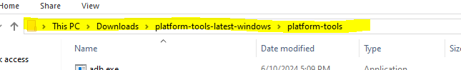

# Materials VR

## Setup for Unity development

First, of course, you must install [Unity Hub](https://unity.com/download)

### Unity Hub

Sign into Unity Hub or create and account. Afterwards, skip installing the Unity editor. It installs the newest one, which is not what we use at the moment.
Agree to Unity personal. It's free.
Afterwards, go to the Unity [Archives](https://unity.com/releases/editor/archive), and install version 2022.3.22f1. It should open up the Unity Hub and give you some options.
Make sure it installs Visual Studio 2022, also select Android Build Support (Quest runs android). Click continue and wait for download/install.

### Repo

Clone this repo somewhere you'll have easy access to.
``git clone https://github.com/redassser/MaterialsVR``

Once the Visual Studio and Unity Editor installs are done, under projects in Unity Hub, click Add in the top right and navigate to the cloned Repo.
Let it open and decline any meta stuff.

### Editor

Once in the editor, select the scene called "Level 1" under Assets/Scenes to see the working scene.

It should have all the packages already.

## Setup and Installation for Testing

To begin, please activate developer mode on your Quest headset so that we may install external APKs.

### Developer mode

First, you must create an "Organization". It doesn't have to be official, any name works, it's just so you can enable developer mode. Do so [on the meta site](https://dashboard.oculus.com/organizations/create/). Make sure to log in!

Second, open the Quest phone app, go to menu in the bottom right, select devices, then select the device you want to use. Then you can enable developer mode from there.

### ADB

Now to install ADB (Android Debugger) on your computer so you can install through USB. Download the platform tools [here on the android site](https://developer.android.com/tools/releases/platform-tools#downloads) by clicking on download SDK for Windows. Agree to the conditions and download.

Unzip the file you downloaded and place it somewhere you'll remember. Please copy the path of the folder by clicking somewhere here \/

Then, type "Environment" into your windows search bar until you see "Edit the System Environment Variables". Clikc that and then click the `Environment Variables` button.

Under System variables, please select Path, then click `Edit...`, then click New and paste in the path you previously copied.

After that click through OKs until those windows are closed. Now you can use the ``adb`` command in the Windows Command Prompt, and setup is complete.

### Installation

To install the APK, first you must download it from the latest release here on the right of this page. Or [click here](https://github.com/redassser/MaterialsVR/releases) and download the latest build APK file.

You must also make sure the Quest headset you have put into developer mode is plugged into the computer you installed ADB on through USB.

Now in the Windows Search Bar type CMD to open Command Prompt.

Type in `adb devices` to make sure that your computer is detecting the headset correctly. If so, then please type in `adb install [path to APK file]`. The path must end with a correct .apk file, itll probably look like `adb install C:\Users\Name\Downloads\materialsVRbuild5.0.apk`.

You may have gotten an error when you typed `adb devices`. If it says `adb is not recognized` or something, you have to check that the path you put in the environmet variables is the correct one to the unzipped folder. Another one is maybe your Quest is not being detected. This may be either because your Quest is not in Developer Mode, or because your USB cable is power only, not data. I hope you know which.

If no error, then wait for the install to finish, then you can check your Quest library in your headset (after sorting by unknown sources at the top) to play it!
